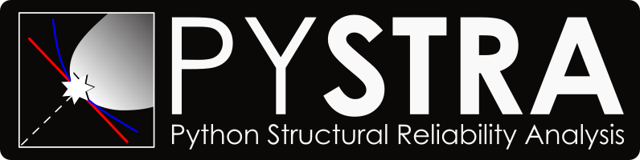

***********************************************
Pystra - Python Structural Reliability Analysis
***********************************************

PySTRA provides a carefully validated implementation of established and
selected modern structural reliability methods, coupled with practical tools
for code calibration and structural assessment. It integrates with NumPy,
SciPy and pandas, and supports reliability models defined by Python functions.

Installation
============

This branch develops **PySTRA 2.0** with a breaking API. Install this branch to
run its examples::

   git clone --branch v2.0 https://github.com/pystra/pystra.git
   cd pystra
   python -m pip install -e .
   python -c "import pystra; print(pystra.__version__)"

Use ``python -m pip install -e '.[al]'`` for the optional active-learning
methods. The `installation guide <docs/source/install.md>`_ covers environments
and notebooks. Existing users should read the
`migration guide <docs/source/migrating.rst>`_.

For the stable 1.x release, use ``python -m pip install pystra`` and its
`stable documentation <https://pystra.github.io/pystra/>`_.

Features
========

* FORM and SORM, direct and importance sampling, line sampling and subset simulation.
* Explicit copulas and probability transformations, component and system reliability.
* Code calibration with normalized reliability, load combinations and FBC processes.
* Structural decision studies, target reliability and consequence/cost models.
* Optional surrogate-assisted reliability with independent benchmark checks.
* Result records, tables and reusable plotting helpers for engineering studies.

Limit states are Python functions. Each algorithm has response-smoothness,
transformation and convergence requirements; use the
`method-selection guide <docs/source/guides/methods.rst>`_ to choose a starting
point and plan validation.

Getting started
===============

The `first analysis <docs/source/notebooks/ex_first_analysis.ipynb>`_ checks FORM
against an exact resistance-minus-load probability. Follow the
`example categories <docs/source/tutorial.rst>`_ for more advanced methods and
the `benchmark catalogue <docs/source/benchmarks.rst>`_ for published problems.
See the `contributor guide <CONTRIBUTING.md>`_ to build the v2 documentation locally.

Contributing
============

See the `contributor guide <CONTRIBUTING.md>`_ for v2 coding conventions,
numerical validation, and pull-request guidance, and the
`2.0 migration plan <docs/v2.0-migration-plan.md>`_ for the release sequence.

Credits
=======
Pystra is built on PyRe by Jürgen Hackl; FERUM4.1 by Jean-Marc Bourinet; FERUM by Terje Haukaas and Armen Der Kiureghian.

Copyright 2021 The Pystra Developers.

List of References
==================

[Bourinet2009] J.-M. Bourinet, C. Mattrand, and V Dubourg. A review of recent features and improvements added to FERUM software. In Proc. of the 10th International Conference on Structural Safety and Reliability (ICOSSAR’09), Osaka, Japan, 2009.

[Bourinet2010] J.-M. Bourinet. FERUM 4.1 User’s Guide, 2010.

[DerKiureghian2006] A. Der Kiureghian, T. Haukaas, and K. Fujimura. Structural reliability software at the University of California, Berkeley. Structural Safety, 28(1-2):44–67, 2006.

[Hackl2013] J. Hackl. Generic Framework for Stochastic Modeling of Reinforced Concrete Deterioration Caused by Corrosion. Master’s thesis, Norwegian University of Science and Technology, Trondheim, Norway, 2013.

Licence
-------

PySTRA is distributed under the GNU General Public License, version 3 or
later (GPL-3.0-or-later). See ``LICENSE`` for the terms and retained PyRe notice.
